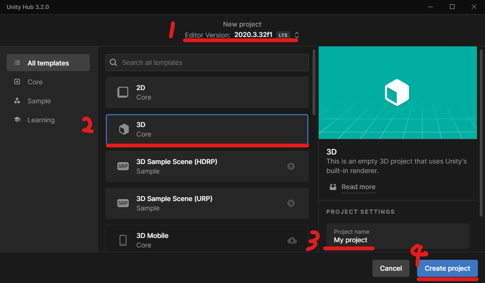
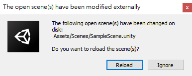

# Virtual to News

To be done.

## Introduction 簡介

To be done.

## Features 特色

- Web crawling
- News keywords extraction
- Trending keywords analysis
- News database management

### CPU及GPU支援性

模組 | CPU | GPU(CUDA) | GPU(ROCm) | Multiple GPUs
:------------ | :-------------| :-------------| :------------- | :-------------
News (PyTorch) | :x: | :white_check_mark: | :white_check_mark: | :shipit:
Voice (PyTorch) | :white_check_mark: | :white_check_mark: | :white_check_mark: | :shipit:
Lip (PyTorch) | :white_check_mark: | :white_check_mark: | :white_check_mark: | :shipit:
Vtuber (OpenCV) | :white_check_mark: | :x: | :x: |

## Docker Installation 安裝說明

### 1. Prerequisites

#### 顯卡驅動及CUDA/ROCm

自行安裝適用於主機的驅動程式。

#### Unity Hub

1. [Download Unity Hub](https://unity3d.com/get-unity/download)

    

2. [Download Unity version 2020.3.32f1](https://unity3d.com/unity/whats-new/2020.3.32)

3. Add License

    

    

#### Docker 及 Docker Compose

**NOTE:** Must be built with a docker version > ??.??\
**注意：** Docker 版本必須 > ??.??

### 2. Clone 本專案並 `cd` 至根目錄

### 3. 下載並放入 models

See 參見 [Model 模型](#model-模型)

### 4. 放入基底聲音、基底影片

See 參見 [Necessary Files 必要檔案](#necessary-files-必要檔案)

### 5. 設定 .env 中的 PyTorch 版本

你需要查閱[完整 PyTorch 安裝指令列表](https://pytorch.org/get-started/previous-versions/)，找出適用 CUDA/ROCm 版本的 Pip Wheel 安裝指令，並將安裝指令中相對應的部份分別填入參數中。完整教學請參閱檔案內的說明：[.env](https://github.com/jerry960331/Virtual-to-News/blob/docker/.env)

### 6. 啟動 docker compose

初次啟動需要下載約10G的資料，可預期花費較長時間。

CUDA版啟動指令

```shell
docker compose -f docker-compose.yml -f docker-compose.cuda.yml up --build
```

ROCm版啟動指令

```shell
docker compose -f docker-compose.yml -f docker-compose.rocm.yml up --build
```

啟動開發模式指令(將程式碼掛載至host)
使用ROCm需修改指令

```shell
docker compose -f docker-compose.yml -f docker-compose.cuda.yml -f docker-compose.dev.yml up --build
```

結束 docker compose\
Ctrl + C

結束並刪除 container

```shell
docker compose down
```

其他指令參見[官方教學](https://docs.docker.com/engine/reference/commandline/compose/#child-commands)

### 7. 開啟 Unity Hub

1. 選擇 Unity 版本 -> 選擇 3D 專案 -> 設定專案名稱 -> 創建專案
    

2. Import unity_vtuber package

    

    

3. Reload scene

    

    若有出現以下破圖情形先進入 Play mode 一次即可解決

    

4. Install Unity Recorder

    

    選擇unity registry -> 搜尋unity recorder -> install package

    

5. **Start Up Game Object**

    先進入 Play mode 才能由 Python 端傳值

    

## From Source 直接部屬說明

To be done.

### Prerequisites

### Clone this repository

```shell
git clone https://github.com/jerry960331/Virtual-to-News-Public.git
```

## Usages

從生成文章到生成vtuber影片，只須一個通用的 request 。建議使用 Postman 來進行請求。

### Request

```request
POST http://{host}:{25501}/{功能}
```

功能有：news, voice, lip, vtuber

### Query parameters

| Parameter name | Value | Description | Default | Additional |
| --- | --- | --- | --- | --- |
| keyword_method | string | 選擇關鍵字提取方式 { keywords, keywords_ner, ... } | Required | 一般情況下使用 keywords 即可 |
| source_path | string | 設定news的輸入資料夾（文章來源、切詞等） | ./news/assets/ |  |
| destination_path | string | 設定news的輸出資料夾（文章來源、切詞等） | ./news/assets/ |  |
| has_title | boolean | 是否把標題加入計算關鍵詞 | True |  |
| end_date | string | 新聞日期 | 今天日期 | 必須符合格式 `YYYY-mm-dd` |
| date_duration | number | 新聞天數 | 7 | 0天 -> 只取 `end_date` 一日 |
| skip_repetitive | number | 是否要跳過重複類型的取關鍵字 | True |  |
| category | number | Google Trends 的[關鍵字類型](https://github.com/pat310/google-trends-api/wiki/Google-Trends-Categories) | Optional | 7 |
| topic | number | 手動輸入主題（跳過自動關鍵字熱度分析） | Optional |  |
| n_chars | number | 篩選關鍵字字元數下限 | Optional | 2 |
| n_times_in_articles | number | 決定關鍵字須出現在幾篇文章中 | 10 | 未接入 |
| n_sentences | string | 決定文章生成的句子數 | 0 (利用生成品質自動選擇) |  |
| shift_pitch | number | 調整pitch（單位為tone） | 0 | 調整Pitch會導致音場改變 |
| voice_mode | string | Vocoder 模式選擇{ rnn, gan } | rnn |  |
| voice_wav_name | string | 參考音檔的檔名 | sample |  |
| uuid | string | 作為產出資產的唯一識別碼。 | 自動生成 | 特殊情況下才會手動設定。特殊用法：若所指定的uuid資料夾內已經包含前置作業所需的檔案，如新聞稿或語音檔，生成時就會自動跳過既有的前置步驟。 |
| news | string | 自訂講稿內容 | 自動生成 | 特殊情況下才會手動設定。 |

### Response

| Status code | Description | Resource |
| --- | --- | --- |
| 200 | OK | 回傳 uuid，可從 `./output/{uuid}/` 中找到產出的資產 |
| 500 | 內部錯誤 |  |

### Example

請注意：Request method 為 `POST`

```shell
localhost:25501/lip?keyword_method=keywords&has_title=True&end_date=2022-10-25&date_duration=2&skip_repetitive=True&category=7&shift_pitch=3&topic=總書記&n_sentences=5&voice_wav_name=LJ1
```

建議使用 Postman 圖形化介面進行參數調整。
純指令介面可以使用 cURL。範例如下：
```shell
curl -X POST "localhost:25501/lip?keyword_method=keywords&end_date=2022-11-16&date_duration=3&voice_mode=gan&topic=%E5%8C%AF%E7%8E%87"
```

## 模型及必要檔案

### Model 模型

| 子專案 | 說明 | 路徑 | 下載路徑 |
| --- | --- | --- | --- |
| news | CKIP 實體辨識模型 | Virtual-to-News/news/assets/model/ckiplab/bert-base-chinese-ner/ | [Link](https://huggingface.co/ckiplab/bert-base-chinese-ner) |
| news | CKIP 詞性辨識模型 | Virtual-to-News/news/assets/model/ckiplab/bert-base-chinese-pos/ | [Link](https://huggingface.co/ckiplab/bert-base-chinese-pos) |
| news | CKIP 切詞模型 | Virtual-to-News/news/assets/model/ckiplab/bert-base-chinese-ws/ | [Link](https://huggingface.co/ckiplab/bert-base-chinese-ws) |
| news | CKIP 模型 | Virtual-to-News/news/assets/model/ckiplab/bert-base-chinese/ | [Link](https://huggingface.co/ckiplab/bert-base-chinese) |
| voice | 合成器的預訓練模型 | Virtual-to-News/voice/synthesizer/saved_models/mandarin_200k.pt | [mandarin_200k.pt](https://drive.google.com/file/d/1H-YGOUHpmqKxJ9FRc6vAjPuqQki24UbC/view) |
| lip | 預訓練權重 | Virtual-to-News/lip/checkpoints/ | [wav2lip.pth](https://iiitaphyd-my.sharepoint.com/:u:/g/personal/radrabha_m_research_iiit_ac_in/Eb3LEzbfuKlJiR600lQWRxgBIY27JZg80f7V9jtMfbNDaQ?e=TBFBVW) / [wav2lip_gan](https://iiitaphyd-my.sharepoint.com/:u:/g/personal/radrabha_m_research_iiit_ac_in/EdjI7bZlgApMqsVoEUUXpLsBxqXbn5z8VTmoxp55YNDcIA?e=n9ljGW) |
| lip | 臉部辨識模型 | TO BE DONE | s3fd：Link |

### Necessary Files 必要檔案

| 子專案 | 說明 | 路徑 | 下載路徑 |
| --- | --- | --- | --- |
| news | 新聞資料庫 | Virtual-to-News/news/assets/json |  |
| lip | 輸入音檔 | Virtual-to-News/lip/outputs/{uuid}/voice.wav | s3fd：Link |
| lip | 嘴型生成的基底影片 | Virtual-to-News/lip/base_video/ | [base_video.zip](https://o365nutc-my.sharepoint.com/:u:/g/personal/s1410831049_ad1_nutc_edu_tw/EbL9t4OM84BNpy7x7y_cFaoBqdNX5DSncTWYie-qOGp_gw?e=kyOU6E) |


## Misc. 雜項

### 特殊用法說明

#### 使用自訂講稿生成影片

1. 講稿放入 `./outputs/{自訂資料夾名稱}/` 中。或著，於API params中加入 `transcript` 並傳入講稿
2. API params加入 `uuid` 並傳入 `{自訂資料夾名稱}`

例如
```shell
POST localhost:25501/lip?uuid=my_folder&transcript=張安樂安樂死安樂死安樂死安樂死四十四隻石獅子。工信處女幹事每月經過下屬科室都要親口交代24口交換機等技術性器件的安裝工作
```
